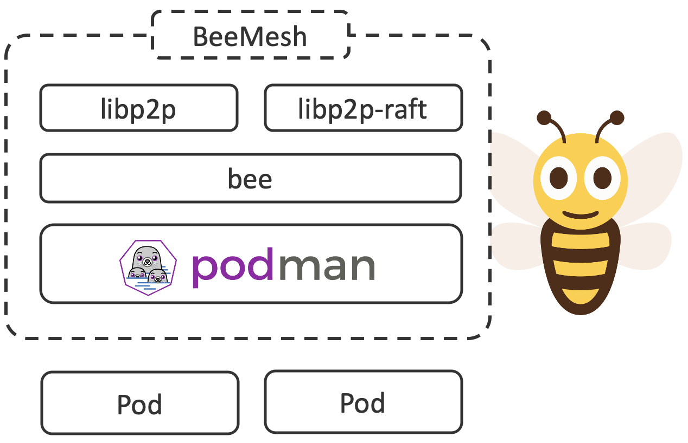
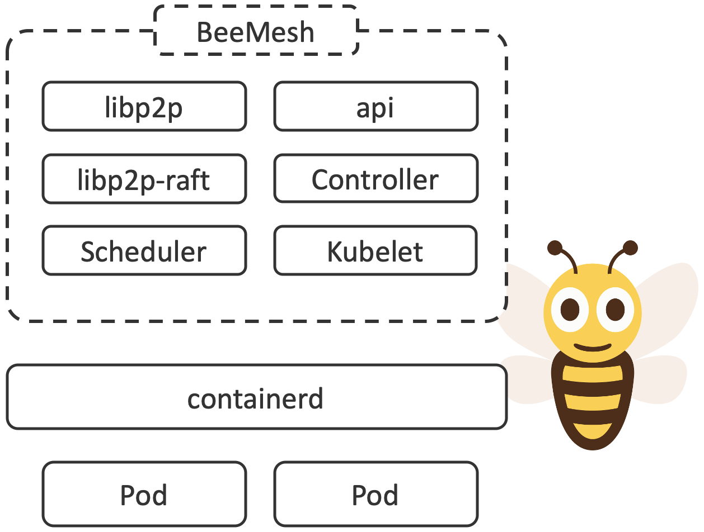

## Overview
BeeMesh comes as a single binary for datacenters, edge and mobile computing. Simply join and start deploy yours.

## Problem Statement
Kubernetes aggregates infrastructure as a single uniform computer. Unity is achieved by a cluster algorithm. The continuous allocation of the workload is done according to this set of rules and repeated as needed. Such uniform computers, called clusters, usually follow the rules of perimeter security in the data center.

Kubernetes follows a scale-out approach when it comes to increasing the resources available for the workload. The infrastructure used can also be requested on a larger scale for a more advantageous utilization rate.

Kubernetes can be extended with network virtualization in different forms. Several clusters are disjoint and therefore require further extensions such as ISTIO and/or cluster federation. Traditional services are excluded and must be considered separately.

The design decisions and ranking for a) clustering and b) connectivity, although individually exemplary and modularly implemented, lead to limitations in terms of scaling and connectivity in traditional datacenters.

## Architecture

BeeMesh prioritises connectivity and dissolves clustering in its present form. Removing the infrastructure clustering eliminates the scaling limits. This favours the software life cycle, reduces the administrative efforts and today's service and data-centric security concepts.

The underlyings naturally prefer participiants beeing alive for longer over newer entrants. Ranking the peer to peer mesh over clustering removes pile up complexity. BeeMesh is designed for massive scale-out and long-lasting processing and functions in mind. 

Clustering is required solely by stateful workload. As such, the problem context shrinks and becomes disposable. The whole architecture encourages stateless zero trust based microservices.

## Policies
Peer to peer mesh policies allows you to make long-lasting processing or functions act as a resilient system through controlling how they communicate with each other as well as with external services.

## API
A Kubernetes compliant API is encouraged so that workloads can be shifted smoothly.

## Building Blocks
* P2P: [https://libp2p.io/](https://libp2p.io/)
* Workload Clustering: [https://github.com/libp2p/go-libp2p-raft](https://github.com/libp2p/go-libp2p-raft)
* Lightweight Kubernetes: [https://k3s.io/](https://k3s.io/)
* Podman: https://github.com/containers/libpod
* Example P2P Database: https://github.com/orbitdb

## Longterm

In case of reliability issues with the  in the long term, an alternative architecture designed for stability is strongly adivced. This is to be achieved by considering Cri-O and Kubernetes instead of Podman AND retaining the new innovative design decisions.

### Architecture

